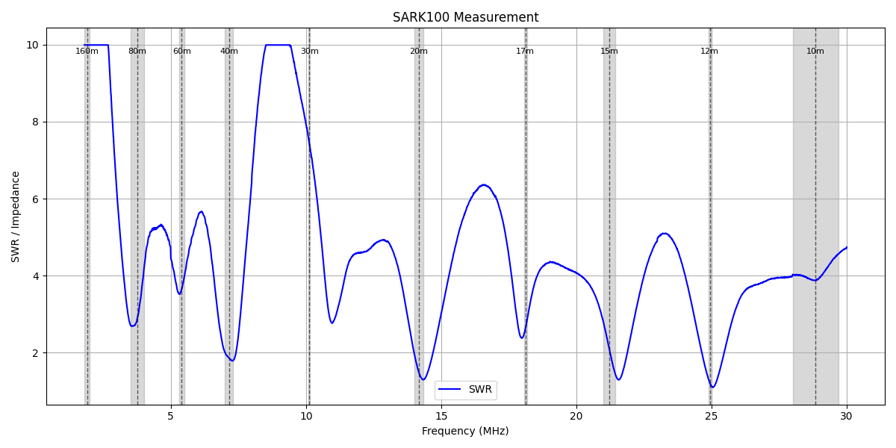
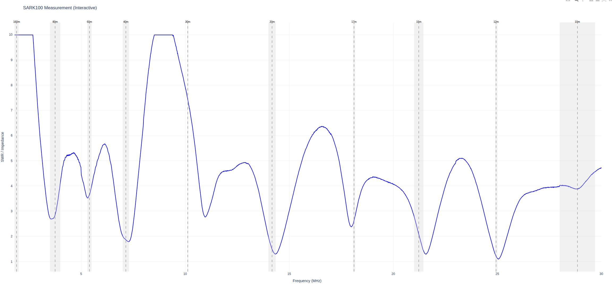
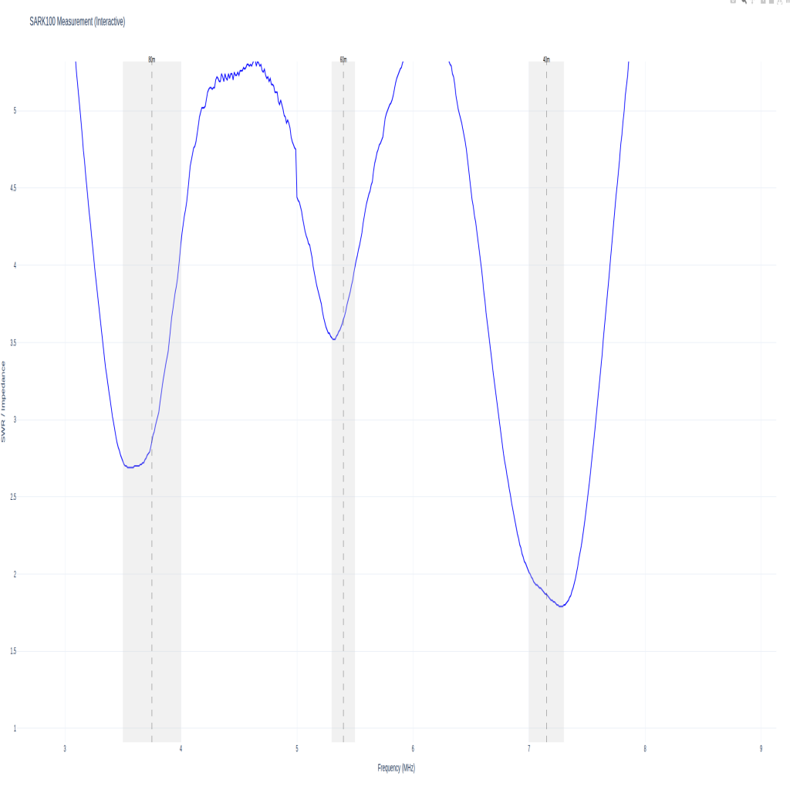

# SARK100 Python Library

A comprehensive Python library and command-line interface for interfacing with the SARK100 SWR/Antenna Analyzer. This library enables automated frequency sweeps, data collection, and visualization of antenna measurements.

## Features

- **Serial Communication**: Direct interface with SARK100 via USB/serial connection
- **Frequency Sweeps**: Automated scanning across custom frequency ranges or predefined amateur radio bands
- **Amateur Radio Band Support**: Built-in definitions for HF bands (160m-10m) plus 6m
- **Multiple Visualization Options**:
  - Static PNG plots with matplotlib
  - Interactive web-based charts with Plotly
  - Real-time PyQtGraph displays with pan/zoom
- **Data Analysis**: Collect SWR, R (resistance), X (reactance), and Z (impedance) measurements
- **Progress Tracking**: Optional progress bars for long scans
- **Band Visualization**: Overlay amateur radio band boundaries on plots

## Installation

### Prerequisites

Ensure you have Python 3.7+ installed, then install the required dependencies:

```bash
pip install -r requirements.txt
```

### Dependencies

- `pyserial` - Serial communication with SARK100
- `polars` - Fast data manipulation and analysis
- `matplotlib` - Static plotting
- `plotly` - Interactive plotting
- `pyqtgraph` - Real-time plotting
- `PyQt5` - GUI framework for PyQtGraph
- `tqdm` - Progress bars

## Hardware Setup

1. Connect your SARK100 to your computer via USB
2. Ensure the device appears as a serial port (typically `/dev/ttyUSB0` on Linux, `COM1` on Windows)
3. Verify the device is accessible and responsive

## Usage

### Command Line Interface


The `sark100` CLI tool provides a full-featured command-line interface for the SARK100:

#### Scan Custom Frequency Range

```bash
sark100 scan --start 14000000 --end 14350000 --step 10000 --plot 20m_scan.png --show_df
```

#### Scan Amateur Radio Bands

```bash
# Scan 20m band with 1% buffer and interactive plot
sark100 scan_band 20m --buffer 0.01 --plot-interactive

# Scan 40m band with PyQtGraph display
sark100 scan_band 40m --plot-pyqt --show-bands
```

#### Command Line Options

**Global Options:**
- `--device DEVICE` - Serial port (default: `/dev/ttyUSB0`)
- `--progress` - Show progress bar during scan

**Scan Commands:**
- `scan` - Custom frequency range
  - `--start FREQ` - Start frequency in Hz (required)
  - `--end FREQ` - End frequency in Hz (required)
  - `--step FREQ` - Step size in Hz (default: 10000)

- `scan_band BAND` - Predefined amateur radio band
  - `BAND` - Band name: `160m`, `80m`, `60m`, `40m`, `30m`, `20m`, `17m`, `15m`, `12m`, `10m`, `6m`, `hf`
  - `--buffer PCT` - Percentage buffer before/after band (default: 0.01)
  - `--step FREQ` - Step size in Hz (default: 10000)

**Plot Options:**
- `--show-r` - Include resistance (R) in plots
- `--show-x` - Include reactance (X) in plots  
- `--show-z` - Include impedance (Z) in plots
- `--show-bands` - Show amateur radio band overlays (default: true)

**Output Options:**
- `--plot [FILENAME]` - Save static PNG plot
- `--plot-interactive` - Show interactive Plotly chart
- `--plot-pyqt` - Show PyQtGraph real-time chart
- `--show_df` - Print raw data to console

### Python Library API

#### Basic Usage

```python
from pysark100 import sark100

# Connect to SARK100
analyzer = sark100(port='/dev/ttyUSB0')

# Scan frequency range
scan = analyzer.scan(start=14000000, end=14350000, step=10000, progress=True)

# Get data as Polars DataFrame
df = scan.get_dataframe()
print(df)

# Generate plots
scan.plot(filename='my_scan.png', include_r=True, show_bands=True)
scan.plot_interactive(include_x=True, include_z=True)
scan.plot_pyqtgraph(include_r=True, include_x=True, include_z=True)
```

#### Band Scanning

```python
# Scan amateur radio band with buffer
scan = analyzer.scan_band('20m', buffer_pct=0.05, step=5000, progress=True)

# Iterate through measurements in real-time
for measurement in scan:
    print(f"Freq: {measurement['freq']} Hz, SWR: {measurement['swr']}")
```

#### Available Bands

The library includes predefined amateur radio bands:

| Band | Frequency Range |
|------|----------------|
| 160m | 1.8 - 2.0 MHz |
| 80m  | 3.5 - 4.0 MHz |
| 60m  | 5.3 - 5.5 MHz |
| 40m  | 7.0 - 7.3 MHz |
| 30m  | 10.1 - 10.15 MHz |
| 20m  | 14.0 - 14.35 MHz |
| 17m  | 18.06 - 18.168 MHz |
| 15m  | 21.0 - 21.45 MHz |
| 12m  | 24.89 - 24.99 MHz |
| 10m  | 28.0 - 29.7 MHz |
| 6m   | 50.0 - 54.0 MHz |
| hf   | 1.8 - 30.0 MHz |

## Data Format

Each measurement returns:
- **freq**: Frequency in Hz
- **swr**: Standing Wave Ratio
- **r**: Resistance in Ohms  
- **x**: Reactance in Ohms
- **z**: Impedance magnitude in Ohms

## Examples

### Find Best SWR in Band

```python
scan = analyzer.scan_band('20m', step=5000)
df = scan.get_dataframe()

# Find frequency with lowest SWR
best_freq = df.filter(df['swr'] == df['swr'].min())
print(f"Best SWR: {best_freq['swr'][0]:.2f} at {best_freq['freq'][0]/1e6:.3f} MHz")
```

### Multi-Band Analysis

```python
bands_to_scan = ['40m', '20m', '15m', '10m']

for band in bands_to_scan:
    scan = analyzer.scan_band(band, buffer_pct=0.02)
    scan.plot(filename=f'{band}_analysis.png', show_bands=True)
    print(f"{band} scan complete")
```

## Troubleshooting

### Common Issues

1. **Serial Port Access**: Ensure your user has permission to access the serial port:
   ```bash
   sudo usermod -a -G dialout $USER
   # Log out and back in for changes to take effect
   ```

2. **Device Not Found**: Verify the SARK100 is connected and powered on:
   ```bash
   ls /dev/ttyUSB*  # Linux
   # or check Device Manager on Windows
   ```

3. **Permission Denied**: Try running with sudo or add user to dialout group

4. **Timeout Errors**: Check cable connection and ensure SARK100 is in PC mode

### Error Messages

- `"Error"` responses from SARK100 typically indicate invalid frequency ranges
- Serial timeout errors suggest communication issues
- Check that no other software is using the serial port

## Contributing

Contributions are welcome! Please feel free to submit pull requests or open issues for bugs and feature requests.

## License

This project is open source. Please check the repository for license information.


## Example Plots

### Static Plot (matplotlib)

*Example output from the `plot` function (matplotlib)*

### Interactive Plot (Plotly)

*Example output from the `plot_interactive` function (Plotly)*


*Zoomed view from the `plot_interactive` function (Plotly)*

## Acknowledgments

- Built for the SARK100 SWR/Antenna Analyzer
- Designed for amateur radio operators and RF engineers
- Uses modern Python data science libraries for fast analysis and visualization
